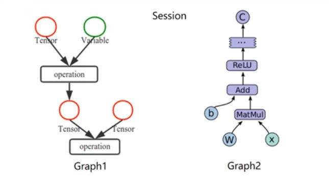

## Tensorflow基本概念

    * 使用图（Graphs）来表示计算任务  
    
    * 在被称之为会话（Session）的上下文（Context）中执行图
    
    * 使用tensor表示数据
    
    * 通过变量（Variable）维护状态
    
    * 使用feed和fetch可以为任意的操作赋值或者从其中获取数据
    
TensorFlow是一个编程系统，使用图来表示计算任务，图中的节点称之为op(operation)，一个op获得0或多个Tensor，执行计算，产生0或多个Tensor。Tensor看做是一个n维的数组或列表。图必须在会话中被启动。

### 变量
tensor和Variable有什么区别？

Variable和Tensor之间的区别：
1. Variable是可更改的，而Tensor是不可更改的。
2. Variable用于存储网络中的权重矩阵等变量，而Tensor更多的是中间结果等。
3. Variable是会显示分配内存空间的，需要初始化操作（assign一个tensor），由Session管理，可以进行存储、读取、更改等操作。相反地，诸如Const, Zeros等操作创造的Tensor，是记录在Graph中，所以没有单独的内存空间；而其他未知的由其他Tensor操作得来的Tensor则是只会在程序运行中间出现。
4. Tensor可以使用的地方，几乎都可以使用Variable。  

————————————————  
版权声明：本文为CSDN博主「Peanut_范」的原创文章，遵循 CC 4.0 BY-SA 版权协议，转载请附上原文出处链接及本声明。
原文链接：https://blog.csdn.net/u013841196/article/details/82960765

Varibale(变量) 、Constant(常量) 和placeholder(占位符)有什么区别？

1. ___变量___：在同一时刻对图中所有其他操作都保持静态的数据  
    初始化：
           个别变量：init_op = variable.initializer()
           所有变量：init_op = tf.initialize_all_variables()  
             
             
2. ___常量___：无需初始化的变量
3. ___占位符___：先为变量占据一个存储空间，后期再赋值  

————————————————  
https://zhuanlan.zhihu.com/p/23932714

### Fetch and Feed  
___fetch___  
为了取回操作的输出内容, 可以在使用 Session 对象的 run() 调用 执行图时, 传入一些 tensor, 这些 tensor 会帮助你取回结果. 在之前的例子里, 我们只取回了单个节点 state, 但是你也可以取回多个 tensor, 需要获取的多个 tensor 值，在 op 的一次运行中一起获得（而不是逐个去获取 tensor）。  

	# fetch
    input1 = tf.constant(3.0)
    input2 = tf.constant(2.0)
    input3 = tf.constant(5.0)

    add = tf.add(input2, input3)
    mul = tf.multiply(input1, add)

    with tf.Session() as sess:
        result = sess.run([mul, add])
        print(result)  

___feed___  
feed 使用一个 tensor 值临时替换一个操作的输出结果. 你可以提供 feed 数据作为 run() 调用的参数. feed 只在调用它的方法内有效, 方法结束, feed 就会消失. 最常见的用例是将某些特殊的操作指定为 "feed" 操作, 标记的方法是使用 tf.placeholder() 为这些操作创建占位符.  

	# feed
	input1 = tf.placeholder(tf.float32)
	input2 = tf.placeholder(tf.float32)
	
	add = tf.add(input1, input2)
	
	with tf.Session() as sess:
	    # feed的数据以字典形式传入
	    result = sess.run(add, feed_dict={input1:[8.], input2:[3.]})
	    print(result)
	   

 
### 简单示例（线性回归）
	import tensorflow as tf
	import numpy as np
	import warnings
	warnings.filterwarnings('ignore')
	
	# 使用numpy生成100随机点
	x_data = np.random.rand(100)
	y_data = x_data * 0.1 + 0.2
	
	# 构建一个线性模型
	k = tf.Variable(0.)
	b = tf.Variable(0.)
	y = k * x_data + b
	
	# 二次代价函数
	loss = tf.reduce_mean(tf.square(y_data-y))
	
	# 定义一个梯度下降法来进行训练的优化器
	optimizer = tf.train.GradientDescentOptimizer(0.2)
	# 最小化代价函数
	train = optimizer.minimize(loss)
	
	# 初始化变量
	init = tf.global_variables_initializer()
	
	# 开启对话执行
	with tf.Session() as sess:
	    sess.run(init)
	    for step in range(201):
	        sess.run(train)
	        if step%20 == 0:
	            print(step, sess.run([k, b]))