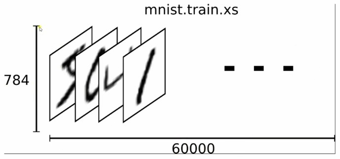
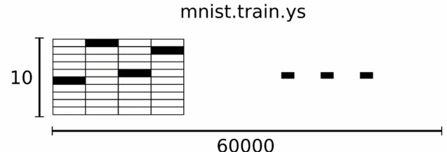
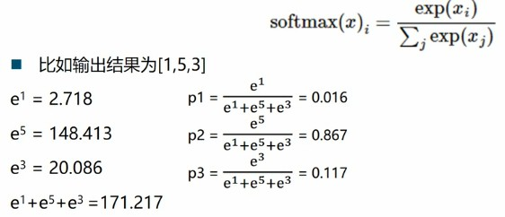

## MNIST数据集  

The MNIST database of handwritten digits, available from this page, has a training set of 60,000 examples, and a test set of 10,000 examples. It is a subset of a larger set available from NIST. The digits have been size-normalized and centered in a fixed-size image.  

### MNIST训练集训练数据
每一张图片包含28*28个像素，将这一个数组展开成一个向量，长度为28*28=784。因此mnist.train.images是一个形状为[60000, 784]的张量，第一维度是索引，第二维度用于检索每张图片的像素点，图片的某个像素的强度值介于0-1之间。  
  
    

### MNIST训练集训练数据标签数据
MNIST数据集是介于0-9的数字，我们要把标签转化为"one-hot vector"。一个one-hot向量除了某一位是1外，其余维度数字都是0，比如标签0表示为([1,0,0,0,0,0,0,0,0])，标签3表示为([0,0,0,1,0,0,0,0,0])  

则mnist.train.label是一个[60000, 10]的数字矩阵  

 

### Softmax函数  
softmax函数用于数字图片的多分类  

 