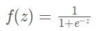

## 损失函数和激活函数  

### 损失函数
真实值和预测值的差别  

在有监督的学习中，需要衡量神经网络输出和所预期的输出之间的差异大小。这种误差函数需要能够反映出当前网络输出和实际结果之间一种量化之后的不一致程度，也就是说函数值越大，反映出模型预测的结果越不准确。

**1.二次代价函数（又称均方差损失, MSE）**

我们使用梯度下降法调整权值参数的大小，求权值w和偏置b的梯度推导  

其中，z表示神经元的输入，σ表示激活函数。w和b的梯度跟激活函数的梯度成正比，激活函数的梯度越大，w和b的大小调整的越快，训练收敛得就越快。 

MSE的缺点：和σ的导数有关，可能会产生收敛速度缓慢的现象(以sigmoid函数为例) 
 

  
在激活函数的两端，梯度（黄色）都会趋向于0，采取MSE的方法衡量损失，在a趋向于1而y是0的情况下，损失loss是1，而梯度会趋近于0，在误差很大时收敛速度也会非常慢。  

**2.交叉代价函数(cross-entropy)**

换一个思路，不改变激活函数，改变损失函数，使用交叉熵损失函数  

其中，C表示损失函数，x表示样本，y表示实际值，a表示输出值，n表示样本总数

我们可以看到权值和偏置值的调整和σ'(z)无关，另外，梯度公式中σ(z)-y表示输出值和实际值的误差。所以当梯度越大时，梯度就越大，w和b的调整就越快，训练的速度也越快。

如果输出神经元（**即为最后一层激活函数**）时线性的，那么二次代价函数就是一种合适的选择。如果输出神经元时S型函数，那么比较适合使用交叉熵损失函数。

**3.对数损失函数(Log-likelihood Loss)**  

### 激活函数

**1.Sigmoid函数**  
公式：  

反向传播：  

  

sigmoid函数的作用将输入限制到(0, 1)这个范围内

特点： - 输出范围0-1，很符合人的主观意识，即神经元对感知的也是从不激活(0)到完全激活(1)。 - 单调连续 - 容易求导，导数为$f(x)(1-f(x))$，用自己就可以表示自己的导数。

缺点：  
&nbsp;&nbsp;&nbsp;&nbsp;具有软饱和性（左软饱和性指x趋近于负无穷，导数趋近于0，右饱和性指x趋近于正无穷，导数趋近于0），在输出值较大较小时，网络很难更新，因为BP算法是更具梯度来进行的，这也是所谓的梯度消失问题。  
&nbsp;&nbsp;&nbsp;&nbsp;均值漂移

**2.tanh函数**  
公式：  

反向传播：  

  

无论从理论公式还是函数图像，这个函数都是一个和sigmoid非常相像的激活函数，他们的性质也确实如此。但是比起sigmoid，tanh减少了一个缺点，就是他本身是零均值的，也就是说，在传递过程中，输入数据的均值并不会发生改变，这就使他在很多应用中能表现出比sigmoid优异一些的效果。

特点： - 收敛速度比sigmoid函数快，原因是：tanh 的输出均值比 sigmoid 更接近 0，SGD会更接近natural gradient（一种二次优化技术），从而降低所需的迭代次数。  

缺陷： - 依然存在软饱和性。

**3.ReLU函数**  

 

 

特点： - 当输入为正数时，输出导数恒为1，缓解了梯度消失的问题。 - 为网络带来稀疏性，当输入值小于0，就会被稀疏掉，人的大脑稀疏性高达95%。 - 不管是正向计算，还是导数计算都非常简单。

缺点： - 左硬饱和性，当输入小于零时，导数恒为0，会使很多神经元无法得到更新，出现“神经元死亡”。 - relu函数输出无负值。 - 均值漂移，relu函数的输出均值恒大于0（从relu函数的输出范围就能看出来）。

**4.leaky relu函数**

**5.softmax函数**

参考资料：  
https://blog.csdn.net/SoftwareTeacher/article/details/84302013  
https://zhuanlan.zhihu.com/p/61669205
