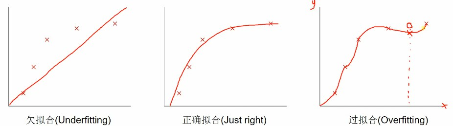
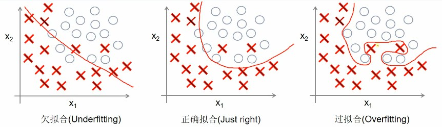
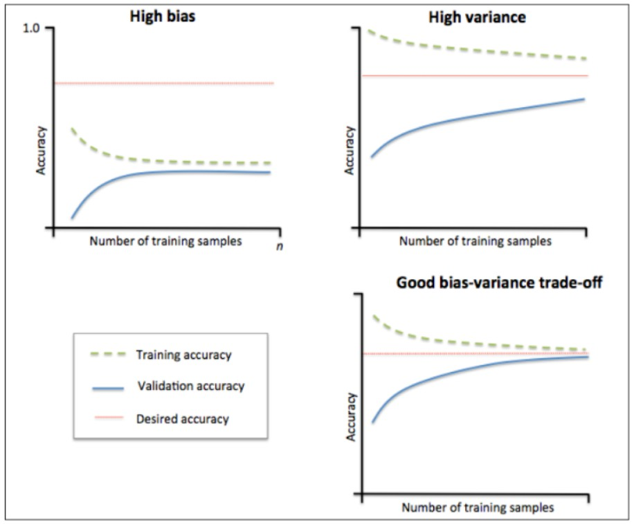
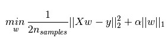
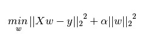
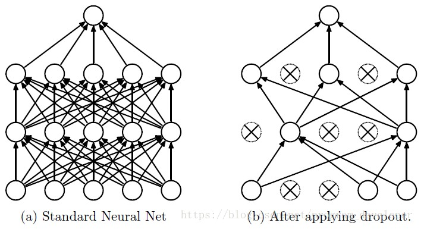

### 拟合

**如何判断欠拟合、过拟合？**

学习曲线：通过画出不同训练集大小时训练集和交叉验证的准确率，判断模型在训练集和测试集上的性能，来判断模型是否过拟合或欠拟合

当训练集和测试集误差收敛但训练精度很低时，如上图左上角所示，训练集和测试集准确率都很低，很可能是欠拟合。可以通过增加模型参数，如构建更多的特征，减少正则项。增加数据集不起作用。

当训练集和测试集的测试准确性相差很大时，一般是训练集的准确率要比测试集的准确率相差很多，一般都是过拟合。此时可以通过增大数据集，降低模型复杂度，增大正则项，或者动过特征选择减少特征数。

理想的情况为右下角的图，训练集和测试集之间收敛并且误差较小。

**防止过拟合**  

* 增加数据集
* 正则化(Regularization)方法  

___L1正则化(L1范数)和L2正则化(L2范数)___

L1正则化和L2正则化可以看做是损失函数的惩罚项，是对损失函数中某些参数做一些限制
下面两个公式是对线性回归模型的损失函数增加惩罚项，第一个公式使用L1正则化项(式中加号后面的一项)的模型叫Lasso回归，第二个公式使用L2正则化项的模型叫Ridge回归，α称之为正则化系数，可由用户自己决定。   
   
  

L1正则化是指权值向量w中各个元素的绝对值之和，通常表示为||w||_1  

L2正则化是指权值向量www中各个元素的平方和然后再求平方根（可以看到Ridge回归的L2正则化项有平方符号），通常表示为||w||_2  

(后期补充)  

* Dropout

___什么是dropout?___

Dropout可以看做是训练深度神经网络的一个技巧。在每个训练批次中，通过忽略一部分的隐藏层神经元，减少隐藏层神经元之间的相互作用。简单来说，dropout的作用就是在前向传播的时候，让某个神经元的激活值以一定的概率p停止工作，这样可以使模型泛化性更强，因为它不会太依赖某些局部的特征。

(后期补充) 

参考资料：  
https://blog.csdn.net/aliceyangxi1987/article/details/73598857  
https://blog.csdn.net/jinping_shi/article/details/52433975    
https://blog.csdn.net/program_developer/article/details/80737724